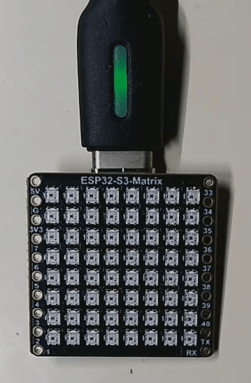

# WS-ESP32-S3-Matrix-Tilted-Square-Fun
Reading a 360 degree tilt angle to change the speed of a expanding and contracting RGB square using the full 8x8 matrix.  
 

 
### A fun little learning project.

#### Things yet to try
- Improve the code to be more sensitive to movement.
- Allow certain movements to change the colors.
- Using a button on the ESP32-S3 to control the display, turn it off and on.

#### Parts List
<ol>
  <li>WAVESHARE ESP32-S3-Matrix</li>
  <li>[WaveShare ESP32 S3 Matrix](https://www.waveshare.com/wiki/ESP32-S3-Matrix)</li>
  <li>USB C Cable for programming the ESP32-S3-Matrix</li>
</ol>

###### Portions of the code were written based on the game demo supplied by WaveShare Dynamic Game Demo.
[Dynamic Game Demo](https://www.waveshare.com/wiki/ESP32-S3-Matrix#Dynamic_Game)
